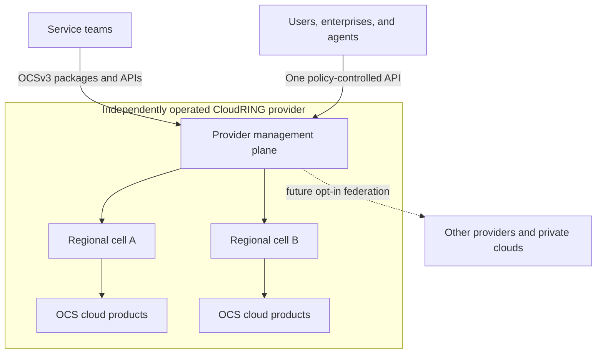

# CloudRING

**An open cloud platform for a world with many providers, many jurisdictions,
and no single point of control.**

CloudRING is an Apache-2.0 open source project for building private clouds,
public cloud providers, and—eventually—a federation of independently operated
clouds. It is being built to combine a provider control plane with OCSv3 (Open
Cloud Standard 3), a portable contract for developing and delivering cloud
services without hard-wiring them into one provider, one platform
implementation, or one technology stack.

> [!WARNING]
> **CloudRING is in early development and is not ready for production or pilot
> use.** Do not use it to operate real workloads, customer data, or critical
> infrastructure. Passing repository tests proves only the code and contracts
> present in that commit. Pilot readiness will be announced separately after
> the required installation, security, durability, upgrade, failure, and user
> journey evidence exists.

## Why CloudRING exists

Cloud computing should not require users to accept permanent dependence on one
provider, one proprietary control plane, or one jurisdiction. It should not
require every regional provider or internal infrastructure team to rebuild the
same identity, lifecycle, billing, portal, and operations foundations from
scratch either.

CloudRING's long-term goal is to make cloud infrastructure an interoperable,
competitive network:

- users choose providers and services for their quality, location, cost, and
  legal fit—not because leaving is impractical;
- providers share a reliable open platform and invest in the services and
  operating experience that differentiate them;
- enterprises run the same model in private infrastructure and can extend it
  with compatible public capacity when appropriate;
- independent teams build cloud services once against a portable contract and
  offer them wherever participating providers allow;
- no single company, provider, control plane, or jurisdiction becomes the
  unavoidable global switch for the whole network.

This is a design goal, not a claim about the current software. CloudRING does
not attempt to bypass law or provider policy. Every operator remains responsible
for the laws, security obligations, commercial terms, and customer commitments
that apply to its deployment.

Read [VISION.md](VISION.md) for the full project direction and the
[public roadmap](roadmap/README.md) for the evidence-gated path from today's
repository to independent provider operation and federation.

## A cloud operating system, not a fixed service bundle

CloudRING treats the platform as a cloud operating system. The target shared
core will provide the capabilities that should not be reinvented for every
service:

- identity, tenancy, IAM, policy, admission, and durable audit;
- catalog, orders, subscriptions, quota, capacity, metering, and billing
  foundations;
- API, CLI, portal, automation, support, and evidence surfaces;
- provider-neutral installation, GitOps, observability, backup/restore,
  upgrade, rollback, and operations contracts;
- regional cells and provider adapters that hide infrastructure-specific
  details behind portable interfaces.

Compute, networks, volumes, Kubernetes, object storage, databases, queues, AI
infrastructure, and future products are cloud services. A service may be part
of CloudRING, maintained by a provider, or developed independently. It becomes
a first-class service by satisfying the same integration and operational
contracts—not by receiving privileged access to platform internals.

## OCSv3: one contract for cloud services

OCSv3 defines how a service participates in the platform while leaving its
implementation replaceable. A conforming module declares its:

- API/controller and lifecycle behavior;
- tenant, project, IAM, and dependency model;
- portal extension and automation interfaces;
- meters, billing linkage, quota, and capacity needs;
- health, readiness, observability, support, and product analytics;
- durability, backup, restore, upgrade, rollback, export, and deletion
  behavior;
- distribution, federation, compatibility, and commercial metadata.

The wire contracts are intended to be language-neutral. The current reference
implementation is Go-first and targets upstream Kubernetes APIs, but a service
does not become portable by sharing CloudRING's implementation language. It
becomes portable by exposing stable APIs, events, packages, and evidence that
another conforming platform can validate and operate.

OCSv3 is a specification developed by the CloudRING project. It is not currently
an accredited international standard or certification scheme. See
[What is OCSv3?](docs/what-is-ocsv3.md), the
[product architecture invariants](docs/product-architecture-invariants.md), the
[OCSv3 architecture](docs/architecture.md), and the
[conformance guide](docs/conformance.md).

## The ecosystem model

CloudRING is designed for four groups whose incentives should reinforce one
another:

| Participant | What CloudRING is intended to provide |
| --- | --- |
| Cloud providers | A reusable provider platform, a way to add differentiated services, and a future path to distribute approved services through a wider network. |
| Enterprises and private-cloud teams | One auditable control surface for internal and external infrastructure, with portable services and an explicit exit path. |
| Service developers | A common development and publication contract for reaching providers and private clouds without a custom integration for each one. |
| Cloud users | A consistent way to discover, consume, operate, and move between compatible services while retaining provider and jurisdiction choice. |

The intended economy is open rather than uniform. A module may be open source,
commercial, provider-specific, or independently licensed. Providers decide
which modules they admit and on what terms. Future marketplace, licensing,
settlement, and revenue-sharing capabilities must be explicit, auditable, and
policy-controlled; none of them is a working production capability today.

## Target architecture



The target separates three concerns:

1. **Provider management plane** — identity, tenancy, product governance,
   commercial policy, APIs, audit, and fleet coordination.
2. **Regional cells** — bounded scale and failure units for lifecycle
   controllers and infrastructure bindings.
3. **Product data planes** — independently built services whose high-volume
   traffic and implementation details do not pass through the platform core.

Federation must not introduce a shared root administrator, universal database,
or mandatory coordinator whose loss disables every provider. Providers opt in
to relationships and retain control over what they expose. Existing workloads
should continue safely through a temporary loss of federation or management
connectivity whenever the product's declared operating model permits it.

## What exists today

The repository already contains useful early slices, including:

- OCSv3 package types, validators, SDK code, conformance fixtures, and a module
  registry contract;
- identity, OIDC/JWKS/JWT, IAM-policy, secure-session, and audit primitives;
- a PostgreSQL-backed transactional-state implementation;
- provider-neutral site inventory, kubeadm rendering, and HA verification
  contracts;
- backup-proof collection, proof signing, one-server-loss observation, HTTP
  security checks, and source-safety tooling.

It does **not** yet provide a complete installation, serving identity platform,
durable provider control plane, executable product registry, production portal,
billing runtime, end-to-end reference cloud product, proven provider pilot, or
working multi-provider federation. Examples and test fixtures are synthetic.

The project reports readiness fail-closed: missing or stale live evidence means
`blocked` or `unverified`, not `ready`.

## Start here

### If you build a cloud service

1. Read [What is OCSv3?](docs/what-is-ocsv3.md).
2. Follow the [developer guide](docs/developer-guide.md) and
   [module authoring guide](docs/module-authoring.md).
3. Inspect the
   [synthetic reference module](reference/synthetic-service/module-package.json).
4. Validate the package with `ocsctl` and the conformance suite.

### If you operate infrastructure

Start with the [provider adapter model](docs/provider-adapters.md),
[site installation contract](docs/provider-site-installation.md), and
[evidence and readiness model](docs/evidence-and-readiness.md). These are early
contracts and tools, not an installation guide for a production cloud.

### If you want to contribute

Read [CONTRIBUTING.md](CONTRIBUTING.md), [GOVERNANCE.md](GOVERNANCE.md), and the
[public repository boundary](docs/public-boundary.md). Contributions are welcome
across the platform runtime, OCSv3, services, adapters, tests, security,
operations, documentation, and developer experience.

## Validate a fresh clone

Prerequisites: Git and the latest security patch of Go 1.25 or 1.26.

```bash
git clone https://github.com/opencloudtech/CloudRING.git
cd CloudRING
go mod download
go test ./... -count=1
go run ./cmd/ocsctl validate ./examples/synthetic-service-module/connector-package.json
go run ./cmd/ocsctl conformance ./reference/synthetic-service/module-package.json
go run ./cmd/cloudring-registry validate ./contracts/module-registry/fixtures/synthetic-module-registry.json
go run ./cmd/cloudring-manifestcheck --root .
```

The inputs above are synthetic. A successful run is repository validation, not
proof that a real cloud deployment is safe or ready.

## Project boundaries

Reusable platform code, contracts, open source modules, provider-neutral
adapters, tests, and documentation belong in this repository. Credentials,
customer or tenant data, private endpoints, deployment-specific configuration,
live evidence, and company-only modules do not.

Independently developed modules remain owned and licensed by their authors
unless they are contributed to CloudRING. See [OWNERSHIP.md](OWNERSHIP.md),
[SECURITY.md](SECURITY.md), and [TRADEMARKS.md](TRADEMARKS.md) for the exact
project boundaries.

## License

CloudRING is licensed under the [Apache License 2.0](LICENSE). See
[NOTICE](NOTICE) for attribution.
